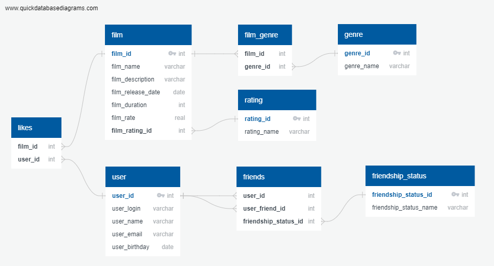

# java-filmorate
Template repository for Filmorate project.



Получение определенных данных всех фильмов:
```roomsql
SELECT f.film_name,
f.film_description,
f.film_rate,
r.rating_name
FROM film AS f
LEFT OUTER JOIN rating AS r ON f.film_rating_id=r.rating_id;
```
Получение определенных данных фильма #3:
```roomsql
SELECT f.film_name,
f.film_description,
f.film_rate,
r.rating_name
FROM film AS f
LEFT OUTER JOIN rating AS r ON f.film_rating_id=r.rating_id
WHERE f.film_id=3;
```
Получение жанров фильма #5:
```roomsql
SELECT g.genre_name
FROM film_genre AS fg
LEFT OUTER JOIN genre AS g ON fg.genre_id=g.genre_id
WHERE fg.film_id=5;
```
Получение названий 10 самых высоких по рейтингу фильмов:
```roomsql
SELECT f.name
FROM film AS f
ORDER BY f.film_rate DESC
LIMIT 10;
```
Получение названий 10 самых популярных (по количеству лайков) фильмов:
```roomsql
SELECT film_name
FROM film
WHERE film_id IN (SELECT film_id
                  FROM likes
                  GROUP BY film_id
                  ORDER BY COUNT(user_id) DESC
                  LIMIT 10);
```
Получение имени и почты всех пользователей:
```roomsql
SELECT u.user_name,
u.user_email
FROM user AS u;
```
Получение имени и почты пользователя #10:
```roomsql
SELECT u.user_name,
u.user_email
FROM user AS u
WHERE u.user_id=10;
```
Получение имени и почты пользователей с 2000г. по 2005г. (года рождения):
```roomsql
SELECT u.user_name,
u.user_email
FROM user AS u
WHERE u.user_birthday BETWEEN 2000 AND 2005;
```
Получение логинов всех подтвержденных друзей пользователя #10:
```roomsql
SELECT login
FROM user
WHERE user_id IN (SELECT f.user_friend_id
                  FROM friends AS f
                  LEFT OUTER JOIN friendship_status AS fs ON f.friendship_status_id=fs.friendship_status_id
                  WHERE f.user_id=10 AND fs.friendship_status_name='Accepted');
```
Получение списка общих друзей пользователей #10 и #15:
```roomsql
SELECT user_friend_10.user_friend_id AS common_friends
FROM (SELECT f.user_friend_id
      FROM friends AS f
      LEFT OUTER JOIN friendship_status AS fs ON f.friendship_status_id=fs.friendship_status_id
      WHERE f.user_id=10 AND fs.friendship_status_name='Accepted') AS user_friend_10
WHERE user_friend_10.user_friend_id IN (SELECT f.user_friend_id
                                        FROM friends AS f
                                        LEFT OUTER JOIN friendship_status AS fs ON f.friendship_status_id=fs.friendship_status_id
                                        WHERE f.user_id=15 AND fs.friendship_status_name='Accepted');
```